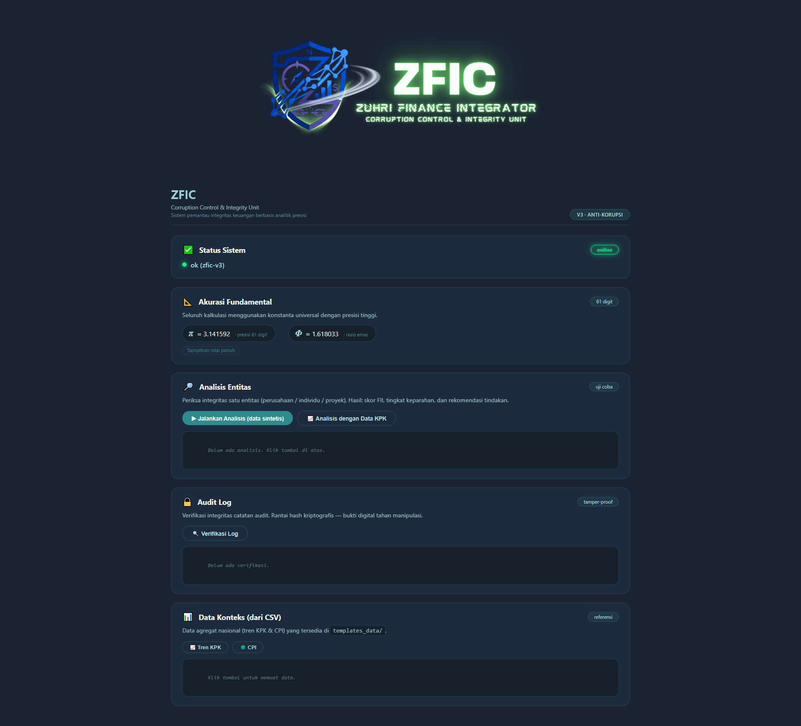

# 🌊 ZFIC — Zuhri Financial Integrity Corruption

**ZFIC** adalah toolkit analitis untuk deteksi anomali harga, skoring risiko entitas (ARS), agregasi indikator sosial-ekonomi (NSV), indeks integritas gabungan (FII), dan audit log tamper-evident. Dibangun dengan presisi 61 digit sebagai jangkar deterministik.

> "Memberantas korupsi melalui analisis berbasis bukti, bukan opini."

---

<details>
<summary>📸 Klik untuk melihat Tampilan Aplikasi</summary>



*Dashboard utama ZFIC -  menampilkan status sistem, konstanta fundamental, analisis entitas, audit log, dan data konteks.*
</details>


---

## 🚀 Fitur Utama

| Fitur | Deskripsi |
|-------|-----------|
| **Bubble Detection** | Deteksi gelembung harga berbasis dekomposisi P-Q dan regret-covariance drift. |
| **Agentic Risk Score (ARS)** | Skor risiko entitas dengan Firth logistic regression (rare-event bias correction). |
| **Net Societal Value (NSV)** | Agregasi indikator sosial-ekonomi dengan normalisasi min-max dan penalti dampak negatif. |
| **Financial Integrity Index (FII)** | Indeks gabungan dari anomali, ARS, dan NSV — dioptimasi dengan grid search + stratified K-fold untuk maksimalkan F1-score. |
| **Audit Log** | Append‑only, hash-chained, tamper-evident — bukti digital tahan manipulasi. |
| **REST API** | Endpoint untuk pipeline, konteks, dan verifikasi audit. |
| **Dashboard Interaktif** | Tema Ocean Depths, dengan tombol analisis sintetis dan data KPK/CPI. |

---

## 🛠️ Teknologi

- **Python 3.10+** dengan Flask, NumPy, Pandas, Scikit-learn
- **Presisi 61 digit** menggunakan `mpmath` untuk konstanta π_eff dan Φ
- **Docker** & **Docker Compose** untuk containerisasi
- **Pytest** untuk unit test

---

## 📁 Struktur Proyek

```text
zfic/
├── zfic/                     # Package inti
│   ├── __init__.py
│   ├── precision_core.py     # Konstanta 61-digit
│   ├── bubble_detection.py   # P-Q bubble & regret
│   ├── ars_scoring.py        # Firth logistic regression
│   ├── fii_nsv.py            # NSV & FII optimisasi
│   ├── audit_alert.py        # Hash-chain audit log
│   └── pipeline_orchestrator.py
├── frontend/                 # UI
│   ├── static/               # CSS, JS, logo
│   └── templates/            # index.html
├── templates_data/           # Template CSV & data konteks
├── tests/                    # Unit test
├── examples/                 # Demo sintetis
├── tools/                    # Utility scripts
├── docs/                     # Dokumentasi & gambar
│   └── ZFIC-screen-page.png
├── app.py                    # Flask entry point
├── setup.py                  # Instalasi package
├── Dockerfile
├── docker-compose.yml
└── README.md

```

## 🚀 Cara Menjalankan

### 1. Instalasi Lokal (Development)

```bash
# Clone repository
git clone https://github.com/[username]/zfic-v3.git
cd zfic-v3

# Install package dalam mode editable
pip install -e .

# Jalankan server
python app.py

# Buka di browser
# http://localhost:8080
2. Dengan Docker
bash
docker compose build
docker compose up -d
# http://localhost:8080
3. Unit Test
bash
pytest tests/ -v
📊 API Endpoint
Endpoint	Method	Deskripsi
/	GET	Dashboard utama
/health	GET	Status server
/precision/constants	GET	Konstanta π_eff dan Φ (61 digit)
/context/national-trend	GET	Data tren KPK (agregat nasional)
/context/cpi	GET	Data CPI per negara
/pipeline/run	POST	Jalankan analisis satu entitas
/audit/verify	GET	Verifikasi integritas audit log
```
---
🧠 Filosofi 61 Digit
---
```
61 desimal BUKAN hiasan. Ini adalah jangkar deterministik yang memastikan setiap perhitungan di seluruh sistem menghasilkan angka yang SAMA PERSIS di mana pun dijalankan. Tanpa ini, hasil analisis akan berbeda antar-instansi, antar-waktu, atau antar-pengguna — sistem menjadi tidak dapat diaudit dan tidak dapat dipertanggungjawabkan.

"Presisi tinggi tidak membuat data yang buruk menjadi baik, tapi membuat data yang baik menjadi terpercaya dan dapat diaudit."
```
---
📜 Lisensi
---
```
MIT License — lihat file LICENSE untuk detail.

```
---
👤 Otoritas & Mandat
---
```
Otoritas Mutlak ZF Core : Syeikh Muhammad Zuhri (Abah FK)
Arsitek Utama: Benny Nugraha, A.md (Abu Syifa al Bantani)
Supported by : Babeh Lutfi Jagur sanFK Jatiwaringin

```
---
Mandat: URIP IKU KUDU URUP | Basmi Korupsi | Jaga Alam Semesta

## 📚 Acknowledgments

ZFIC mengadopsi dekomposisi gelembung harga (P-Q bubble) dari paper:

Jarrow, R. A., & Kwok, S. S. (2026). *P-Bubbles, Q-Bubbles, and Risk Premia*. arXiv:2608.01554v1.

Kami berterima kasih kepada para peneliti atas fondasi teoretis yang memungkinkan pengembangan ZFIC sebagai alat anti-korupsi.


